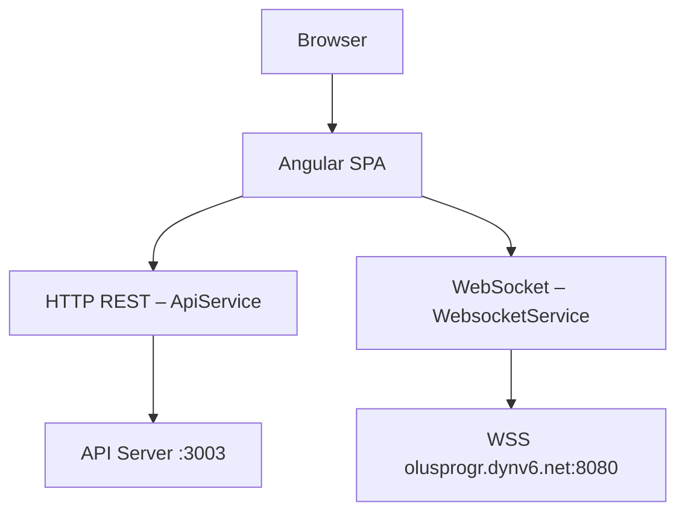

# 🌑 ki-server-new

> [!abstract] Übersicht
> Angular 20 SPA mit SSR (Express) — Dashboard für Geräte-Management, Datei-Up/Download via WebSocket und Echtzeit-Kommunikation.

---

## 🏗 Architektur



### Zwei Backend-Verbindungen

| Verbindung    | Service            | URL (Dev)                          | Zweck                  |
| ------------- | ------------------ | ---------------------------------- | ---------------------- |
| **HTTP REST** | `ApiService`       | `http://localhost:3003/api`        | Auth, CRUD             |
| **WebSocket** | `WebsocketService` | `wss://olusprogr.dynv6.net:8080`   | Dateitransfer, Echtzeit|

> [!info] Upload-Details
> Uploads laufen serialisiert über eine interne Queue. Chunks sind **1 MB** groß und base64-kodiert.

---

### 🔐 Auth-Flow

> [!warning] Schutzmechanismen
> - `authGuard` prüft `localStorage.authToken` → Redirect zu `/login` falls fehlt
> - `environment.bypassLogin = true` überspringt den Guard in Dev
> - `authInterceptor` hängt den Token als `Authorization`-Header an jeden Request

---

### 🗺 Routen

```
/login                        LoginComponent
/share/:token                 FileShareComponent   (public)
/upload/:token                FileUploadComponent  (public)
/dashboard  (authGuard)
  /start                      DashboardComponent
  /:dev/:ipv4                 DeviceComponent
  /analytics                  AnalyticsComponent
  /server                     WsConsole
/error                        ErrorPage
** → /error
```

---

## ⚡ Befehle

> [!tip] Wichtigste Befehle auf einen Blick

```bash
npm start               # Dev-Server auf 0.0.0.0:3001 (lokales Netzwerk)
npm run build           # Produktions-Build → dist/ki-server-new/
npm test                # Karma/Jasmine Unit-Tests
npm run generate-env    # src/env.ts aus .env generieren
npm run deploy          # Build + SSH-Deploy nach 192.168.178.211
npm run watch           # Dev-Build mit Watch-Mode
```

> [!note] Einzelne Tests
> Karma hat keinen CLI-Filter — `fdescribe`/`fit` im Spec-File verwenden, dann `npm test`.

### Scaffolding

```bash
npx ng generate component path/name
```

---

## 🚀 Deploy

```bash
npm run build
ssh root@192.168.178.211 "rm -rf /var/www/login-page/*"
scp -r dist/ki-server-new/* root@192.168.178.211:/var/www/login-page/
```

Oder kurz: `npm run deploy` (führt beides aus).

---

## 🧬 Environment & Secrets

> [!example] Konfigurations-Quellen
> - **Dev-Werte:** `src/environments/environment.ts`
> - **Prod:** `src/environments/environment.prod.ts` (`apiUrl: '/api'`, reverse-proxied via nginx)
> - **Runtime-Env-Vars:** `.env` → `npm run generate-env` → `src/env.ts`

---

## 🎨 Styling

> [!quote] Tooling
> **Tailwind CSS v4** (PostCSS) · Globale Styles in `src/styles.css`
> **Prettier:** `printWidth: 100`, Single Quotes, Angular HTML Parser
